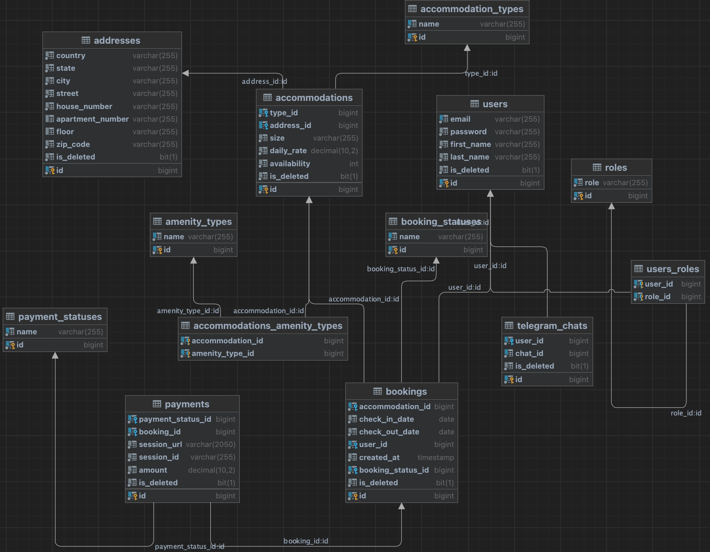

Accommodation Booking System is a backend application built with Java and Spring Boot that simplifies the rental
process for property bookings. It allows users to reserve accommodations, enables managers to manage listings and availability,
and integrates with Stripe for secure payments and Telegram for real-time notifications. Designed to replace outdated manual workflows,
the system offers a modern, scalable, and reliable solution for real-world rental management.

## Entity Relationship Diagram (ERD)
The following diagram visualizes the core entity relationships in the Accommodation Booking System:


## Technologies Used
- **Java 21** — the core programming language used for backend development
- **Spring Boot 3.4.1** — framework for rapid application setup and configuration
- **Spring Security 6.4.4 + JWT 0.12.6** — handles authentication and role-based authorization
- **Liquibase** — enables version-controlled database schema migrations
- **MySQL 8.2.0** — relational database management system
- **Stripe API 24.0.0** — integration for secure online payment processing
- **Telegram Bot API 6.9.7.1** — delivers real-time notifications for bookings and payments
- **Docker & Docker Compose** — used for containerization and local deployment
- **Testcontainers 1.20.6 + JUnit 5** — provides reliable unit and integration testing environments
- **Springdoc OpenAPI 2.8.1 (Swagger)** — generates interactive API documentation
- **GitHub Actions** — automates CI/CD pipelines for testing and deployment
- **Checkstyle** — ensures consistent code quality and formatting
- **Lombok 1.18.34** — minimizes boilerplate code using annotations
- **MapStruct 1.6.3** — automates mapping between entities and DTOs

## Project Structure
The project follows a standard Spring Boot layered architecture, organized into controllers, services, and repositories
to promote clean separation of concerns. All application source code is located in the src/main directory, while test
cases and integration tests reside in src/test.

## Controllers Overview
- **AccommodationController**  
  Handles management of accommodation listings. Allows administrators to create, update, delete, and retrieve accommodations, while unauthenticated users can browse available options.
- **AuthenticationController**  
  Provides user registration and login endpoints. Issues JWT tokens upon successful authentication for secure access to protected resources.
- **BookingController**  
  Manages booking lifecycle including creation, retrieval, updating, and cancellation. Supports role-based access for customers and administrators.
- **PaymentController**  
  Integrates Stripe payment processing. Handles payment initiation, success/cancel callbacks, and retrieval of payment records per user or system-wide.
- **TelegramController**  
  Generates personalized invitation links for Telegram bot integration. Enables customers to receive real-time notifications through Telegram.
- **UserController**  
  Supports profile retrieval, profile updates, password changes, and role management. Includes endpoints for both self-service and admin-level user management.

## Setup
To set up and run the project locally, follow these steps:

1. **Clone the project**
   Run the following commands:
   ```bash
   git clone https://github.com/Nazar1106/accommodation-booking-service.git
   cd accommodation-booking-service
2. **Ensure you have Java 21 installed.**
3. **Ensure you have Maven installed.**
4. **Ensure you have Docker installed.**
5. **Update the database configuration in the `.env` file.**

**Example `.env` file:**
```bash 
###MYSQL###
MYSQLDB_USER=booking_user
MYSQLDB_ROOT_PASSWORD=root12345
MYSQLDB_DATABASE=accommodation_booking_db
MYSQLDB_LOCAL_PORT=3307
MYSQLDB_DOCKER_PORT=3306

###DOCKER###
SPRING_LOCAL_PORT=8081
SPRING_DOCKER_PORT=8080
DEBUG_PORT=5005

###JWT###
JWT_SECRET=your_jwt_secret_here
JWT_EXPIRATIONS=900000

###STRIPE_SECRET_KEY###
STRIPE_SECRET_KEY=your_stripe_key
STRIPE_CANCEL_URL=http://localhost:8080/payments/cancel/{CHECKOUT_SESSION_ID}
STRIPE_SUCCESS_URL=http://localhost:8080/payments/success/{CHECKOUT_SESSION_ID}

###TELEGRAM###
BOT_NAME=your_bot_name_here
BOT_TOKEN=your_bot_token_here
TELEGRAM_SECRET=your_telegram_secret_here
```
6. **Build the project using Maven:**
```bash 
mvn clean package
```
- **Build the image using Docker:**
```bash
docker compose build
```
- **Run the application using Docker:**
```bash
docker compose up
```

## Demo Credentials
Below are predefined users you can use to test authentication and role-based access:
#### 👤 **Administrator Account**
- **Email:** `admin@example.com`
- **Password:** `12345678`
- **Roles:**
  - `ADMIN`

#### 👤 **Customer Account**
- **Email:** `customer@example.com`
- **Password:** `12345678`
- **Roles:**
  - `CUSTOMER`
## Postman Collection
For a quick start, use the provided [Postman Collection](https://www.postman.com/nazar1106/workspace/accommodation-service/collection/32366741-ff28d42a-1ec5-4c1b-9d4b-bf3acb6426a2?action=share&creator=32366741) to test the API endpoints.
## Acknowledgments
We extend our sincere gratitude to the Spring Boot community and the maintainers of the open-source libraries and tools
that made this project possible. Your innovation, dedication, and contributions continue to drive progress and empower
developers around the world.
## Contact
For any questions, feedback, or support inquiries, feel free to reach out to the project maintainer at:  
[**kupnovytskyinazar@gmail.com**](mailto:kupnovytskyinazar@gmail.com)
